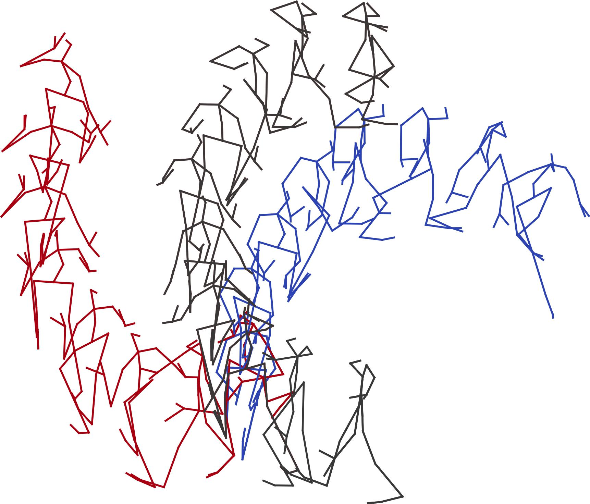
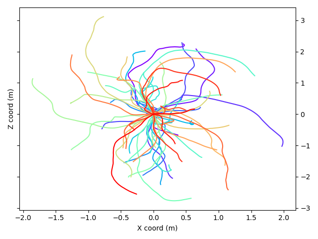

# WalkingDynamicsH36M


## A Benchmarking Dataset for Long-term Motion and Trajectory Forecasting
 

This repository contains the code for our extended abstract at the 
[CVPR 2023 Precognition Workshop](https://sites.google.com/view/ieeecvf-cvpr2023-precognition/ "CVPR 2023 Precognition Workshop")

WalkingDynamicsH36M: a Benchmarking Dataset for Long-term Motion and Trajectory Forecasting

*Cecilia Curreli, Andreu Girbau, Shin’ichi Satoh*

[paper](https://github.com/NII-Satoh-Lab/WalkingDynamicsH36M/tree/main/WalkingDynamicsH36M/WalkingDynamicsH36M/CVPR-WalkingDynamicsH36M.pdf)

We present WalkingDynamicsH36M, a long-term 3D human pose and trajectory dynamics prediction benchmarking dataset extracted from H36M. Our graph-based model GraDyn achieves competitive results on the SoMoF dataset, predicting realistic and consistent motions on our benchmark. We believe the proposed benchmark dataset and model can serve as a foundation for future research in this field.

WalkingDynamicsH36M is suitable for probabilistic mulitmodal future prediction. What is multimodality? The same past can generate different futures, differet so-called future modes. An example on the left figure: how futures from different tracks in the validation split can match the same past. On the right You can see that 
tThe trajectories from the test split are distributed homogenously in space. 

 


Our model GraDyn (in red) generates more realistic images than SoMoFormer (in blue), which predicts trajectories closer to the ground truth. 
 


## Get Started & Installation

### Add conda channels for package install

```
conda config --append channels pytorch
conda config --append channels nvidia
conda config --append channels anaconda
conda config --append channels conda-forge
```

### Set up conda Environment with Pytorch

 - Create conda environment
    ```
    conda create --name hmp
    conda activate hmp
    ```
 - Find out CUDA version with one of the following to determine which pytorch to install

    `nvcc --version`

    `cat /usr/lib/cuda/version.txt`

    `nvidia-smi`
 - Go to Pytorch official page and follow install instructions for your system. This may take some time. Should be similar to:

    `conda install pytorch torchvision torchaudio pytorch-cuda=11.7 -c pytorch -c nvidia`

    After successfully installing pytorch, install ignite:

    `conda install ignite -c pytorch`

### Install other requirements

```
conda install --file requirements.txt
conda install -c anaconda jupyter
conda install -c conda-forge tensorboard
pip install pytorchvideo
```

## Download datasets

### WalkingDynamicsH36M

Register and follow download instruction as described in the official page:
http://vision.imar.ro/human3.6m/description.php

Put folder tracks ("S1", "S5", etc) in data/h36m
```
mkdir data
cd data
mkdir h36m
```

Create the track files for our WalkingDynamicsH36M dataset into the data/ folder

Copy the the images.json files to /data (for visualization purposes)
```
cd WalkingDynamicsH36M
cp ../../WalkingDynamicsH36M/*images.json ./
```
Note that for the training protocol, we still require all training tracks of H36M.


### SoMoF 3DPW 

Dataset page: https://somof.stanford.edu/
```
cd data
```
Follow the download instruction on https://virtualhumans.mpi-inf.mpg.de/3DPW/licensesmof.html 
```
unzip somof_data_3dpw.zip
mkdir 3dpw
```
For the training protocol we also require the whole 3dpw dataset. Follow download instruction at https://virtualhumans.mpi-inf.mpg.de/3DPW/ and place it in data/3dpw

# Train GraDyn

## Train our model Gradyn on SoMoF 3DPW. 

Additional training arguments are described in *somof/train.py*. Adjust CUDA configurations to your device. 
```
cd src
CUBLAS_WORKSPACE_CONFIG=:16:8 CUDA_VISIBLE_DEVICES=0 python3 somof/train.py --config=../config/somof.yaml 
```
## Train our model Gradyn on WalkingDynamicsH36M 

Additional training arguments are described in *wdh36m/train.py*. Adjust CUDA configurations to your device. 
```
cd src
CUBLAS_WORKSPACE_CONFIG=:16:8 CUDA_VISIBLE_DEVICES=0 python3 wdh36m/train.py --config=../config/walking_dynamics_h36m.yaml 
```
# Evaluation and Testing 

## SoMoF 3DPW

Evaluate on validation split of SoMoF 3DPW.

```
cd src
CUBLAS_WORKSPACE_CONFIG=:16:8 CUDA_VISIBLE_DEVICES=0 python3 somof/eval.py --load_path=../output/<exp_name>/checkpoints/<epoch>.pth.tar
```

Save testing results into 3dpw_predictions.json as in official benchmark guidelines for submission.

```
cd src
CUBLAS_WORKSPACE_CONFIG=:16:8 CUDA_VISIBLE_DEVICES=0 python3 somof/test.py --load_path=../output/somof/<exp_name>/checkpoints/<epoch>.pth.tar
```

Submission file will be stored in *../output/somof/<exp_name>/*

## WalkingDynamicsH36M

Evaluate on validation or test split of WalkingDynamicsH36M.

```
cd src
CUBLAS_WORKSPACE_CONFIG=:16:8 CUDA_VISIBLE_DEVICES=0 python3 wdh36m/eval.py --split val --load_path=../output/wdh36m/<exp_name>/checkpoints/<epoch>.pth.tar
```

